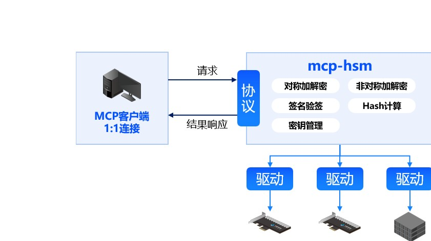

# MCP协议密码套件 (mcp-hsm)

[](https://github.com/sansec-ai/mcp-hsm)

## 简介

mcp-hsm 是一个基于MCP协议的密码套件，旨在为AI应用提供高效的密码学支持。它支持SM2/SM3/SM4算法，通过硬件模块加速性能优化，并提供安全的密钥存储与管理。

## 功能特点

- **标准MCP协议**：方便AI应用集成
- **支持SM2/SM3/SM4算法**：满足国产密码学标准
- **硬件模块加速**：优化性能，提升处理速度
- **HSM密钥管理**：提供更安全的密钥存储与管理
- **兼容GM/T 0018标准**：确保符合国家密码学规范

## 架构概述



- **MCP客户端**：通过1:1连接与mcp-hsm进行通信
- **mcp-hsm**：提供对称加解密、非对称加解密、签名验签、Hash计算和密钥管理等功能
- **硬件驱动**：支持多种硬件模块，实现底层硬件加速

## 安装与使用

### 安装

```bash
git clone https://github.com/sansec-ai/mcp-hsm.git
cd mcp-hsm
```

### 使用示例
- 配置MCP客户端与mcp-hsm的连接
- 调用mcp-hsm提供的API进行加解密、签名验签等操作
- 通过硬件驱动实现性能优化
## 贡献指南
欢迎贡献代码或提出改进建议！请参考贡献指南了解如何参与项目。
## 许可证
mcp-hsm 遵循 Apache License 2.0 协议，允许自由使用、修改和分发。
## 联系我们
如需进一步了解或技术支持，请访问 GitHub项目页面 或联系项目维护者。