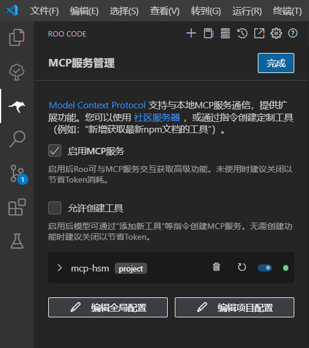

# MCP协议密码套件 (mcp-hsm)  [English Version](./README_en.md)

[](https://github.com/sansec-ai/mcp-hsm)

## 简介

MCP-HSM是一个基于MCP协议的密码套件，旨在为AI应用提供高效的密码学支持。它全面支持国产密码算法，符合密码行业标准规范，采用硬件安全模块提供密钥管理与密码运算服务。

## 功能特点

- **使用自然语言实现密码运算**
- **满足标准MCP协议**：方便AI应用集成
- **支持国产密码算法**：支持SM2/SM3/SM4密码算法
- **符合密码行业标准**：符合《GM/T 0018 密码设备应用接口规范》等标准
- **采用硬件安全模块**：提供更安全的密钥管理与密码运算操作

## 架构概述


- **MCP客户端**：采用标准输入输出（stdio）方式与MCP-HSM进行通信；
- **MCP-HSM**：MCP服务器，为MCP客户端提供各种密码运算与密钥管理工具；
- **硬件驱动**：支持多种硬件安全模块，提供更快速的安全服务；

## 安装与使用（以Windows环境为例）

### 安装

```bash
# 下载源代码到本地
git clone https://github.com/sansec-ai/mcp-hsm.git
cd mcp-hsm
# 安装Python包管理工具uv
pip install uv
# 创建虚拟环境
uv venv
```

### 配置MCP-HSM
MCP-HSM符合标准的MCP协议，可以使用任何MCP客户端调用本密码套件。

本示例采用VS Code中的Roo Code插件作为MCP客户端，使用本套件前应在Roo Code插件中选择可用的API提供商，输入正确的API密钥或基础URL，以及选择模型。在Roo Code的MCP服务管理菜单中，点击编辑项目配置，在创建的mcp.json文件中写入以下内容：

```json
{
  "mcpServers": {
    "mcp-hsm": {
      "command": "uv",
      "args": [
        "--directory",
        ".",
        "run",
        "server.py"
      ],
      "env": {
        "LIBHSM_PATH": ".\\lib\\hsm_0018.dll"
      }
    }
  }
}
```

保存文件，点击重新连接，确保MCP服务已连接。



新建lib目录，将符合《GM/T 0018 密码设备应用接口规范》的接口库重命名为hsm_0018.dll后放入其中。若接口库包含其他依赖库，则需要一同放入该目录。若接口库依赖其他配置文件，请按照接口库提供商的建议放入指定目录中。

### 使用

以使用SM2密钥生成工具为例，在Roo Code对话框中输入”生成SM2密钥对“，发送任务。


如图所示，MCP-HSM能够自动调用HSM模块的接口，生成符合国密规范的SM2密钥对。

## 贡献指南
欢迎贡献代码或提出改进建议！请参考贡献指南了解如何参与项目。

## 许可证
MCP-HSM遵循Apache License 2.0协议，允许自由使用、修改和分发。

## 联系我们
如需进一步了解或技术支持，请访问GitHub项目页面或联系项目维护者。