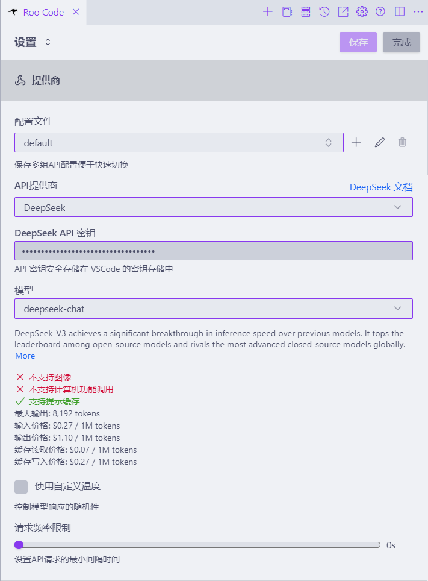
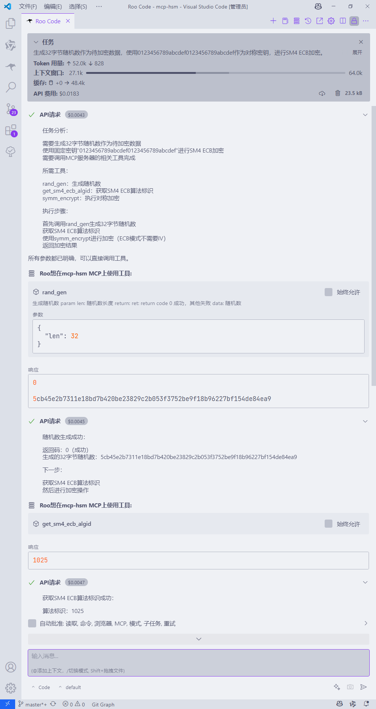
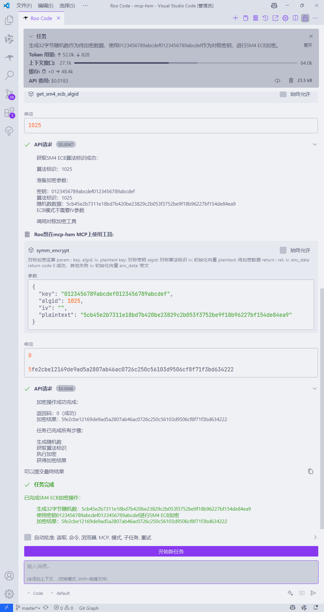

# MCP Protocol Cryptographic Suite (mcp-hsm)

[](https://github.com/sansec-ai/mcp-hsm)

## Introduction

mcp-hsm is a cryptographic suite based on the MCP protocol, designed to provide efficient cryptographic support for AI applications. It supports SM2 / SM3 / SM4 algorithms, optimizes performance through hardware module acceleration, and provides secure key storage and management.

## Key Features

- **Standard MCP Protocol**: Easy integration with AI applications
- **Supports SM2 / SM3 / SM4 Algorithms**: Compliant with national cryptographic standards
- **Hardware Module Acceleration**: Optimized performance and enhanced processing speed
- **HSM Key Management**: Provides secure key storage and management
- **Compliance with GM/T 0018 Standard**: Ensures adherence to national cryptographic regulations

## Architecture Overview


- **MCP Client**: Communicates with mcp-hsm via a 1:1 connection
- **mcp-hsm**: Provides symmetric encryption/decryption, asymmetric encryption/decryption, signature verification, hash computation, and key management functions
- **Hardware Drivers**: Supports multiple hardware modules to achieve low-level hardware acceleration

## Installation and Usage

### Installation

```bash
git clone https://github.com/sansec-ai/mcp-hsm.git
cd mcp-hsm
uv venv
source .venv/bin/activate
# test
uv run tools/server.py
```

### Configuration
- Rename the cryptographic device interface library compliant with the GM/T 0018 standard and place it in the lib directory. For Windows systems, name the interface library hsm_0018.dll; for Linux systems, rename it to libhsm_0018.so.
- Place the configuration files required by the interface library according to the recommendations of the cryptographic device vendor.
- In the Roo Code settings menu, configure the API provider, URL, API key, and model information.

- In the Roo Code MCP service management menu, check if the mcp-hsm service is connected.


### Usage Example
- For example, use a given symmetric key to perform SM4 ECB mode encryption on random data.
- Input the following content in Roo Code:
```plaintext
生成32字节随机数作为待加密数据，使用0123456789abcdef0123456789abcdef作为对称密钥，进行SM4 ECB加密。
```
- The MCP service invocation process is shown in the following figures：



## Contribution Guidelines
We welcome contributions or suggestions for improvement! Please refer to the contribution guidelines to learn how to participate in the project.

## License
mcp-hsm follows the Apache License 2.0, allowing free use, modification, and distribution.

## Contact Us
For further information or technical support, please visit the GitHub project page or contact the project maintainers.