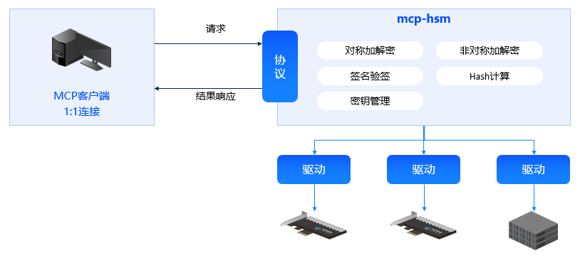
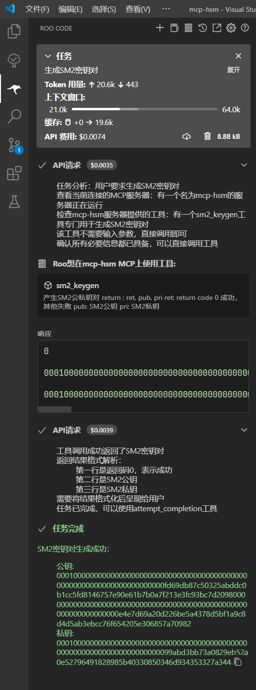

# MCP Protocol Cryptographic Suite (mcp-hsm)

[](https://github.com/sansec-ai/mcp-hsm)

## Introduction

MCP-HSM is a cryptographic suite based on the MCP protocol, designed to provide efficient cryptographic support for AI applications. It fully supports domestic cryptographic algorithms, complies with cryptographic industry standards, and uses hardware security modules to provide key management and cryptographic operation services.

## Key Features

- **Perform cryptographic operations using natural language**
- **Compliant with standard MCP protocol**: Easy integration for AI applications
- **Supports domestic cryptographic algorithms**: SM2/SM3/SM4 cryptographic algorithms supported
- **Complies with cryptographic industry standards**: Adheres to standards such as "GM/T 0018 Interface specifications of cryptography device application"
- **Utilizes hardware security modules**: Provides more secure key management and cryptographic operations

## Architecture Overview



- **MCP Client**: Communicates with MCP-HSM using standard input/output (stdio);
- **MCP-HSM**: The MCP server that provides cryptographic operations and key management tools for the MCP client;
- **Hardware Drivers**: Supports various hardware security modules, offering faster and more secure services;

## Installation and Usage (Windows Environment Example)

### Installation

```bash
# Clone the source code
git clone https://github.com/sansec-ai/mcp-hsm.git
cd mcp-hsm
# Install Python package manager uv
pip install uv
# Create a virtual environment
uv venv
```

### Configuration MCP-HSM

MCP-HSM adheres to the standard MCP protocol and can be invoked by any MCP client.

This example uses the Roo Code plugin in VS Code as the MCP client. Before using this suite, select an available API provider in the Roo Code plugin, enter the correct API key or base URL, and choose the model. In the Roo Code MCP service management menu, click "Edit Project Configuration" and write the following content into the created mcp.json file:

```json
{
  "mcpServers": {
    "mcp-hsm": {
      "command": "uv",
      "args": [
        "--directory",
        ".",
        "run",
        "server.py"
      ],
      "env": {
        "LIBHSM_PATH": ".\\lib\\hsm_0018.dll"
      }
    }
  }
}
```

Save the file and click "Reconnect" to ensure the MCP service is connected.


Create a lib directory, rename the interface library compliant with "GM/T 0018 Interface specifications of cryptography device application" to hsm_0018.dll, and place it in the directory. If the interface library includes other dependent libraries, they should also be placed in the same directory. If the interface library depends on other configuration files, follow the recommendations of the interface library provider and place them in the specified directory.

### Usage

For example, to use the SM2 key generation tool, type "Generate SM2 key pair" in the Roo Code dialog box and send the task.



As shown in the image, MCP-HSM can automatically invoke the HSM module's interface to generate an SM2 key pair compliant with domestic cryptographic standards.

## Contribution Guidelines
We welcome contributions or suggestions for improvement! Please refer to the contribution guidelines to learn how to participate in the project.

## License
MCP-HSM follows the Apache License 2.0, allowing free use, modification, and distribution.

## Contact Us
For further information or technical support, please visit the GitHub project page or contact the project maintainers.